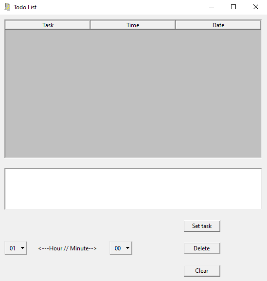

# Better Todo #
##### A simple todo list made with python.

## Installation 
1. Download from [here](https://github.com/brtcrt/Better-Todo/tree/releases).
2. Unzip the folder.
3. Run Better-Todo.exe.

### General Info
```
A simple way to keep note of things while working/taking classes. 
Add anything you think you might need to remember to this todo list.
``` 



### Warning!
##### It would be preferable for the user to set this so it would start with windows. Here is how to do it for windows:
1. Make a shortcut of Better-Todo.exe.
2. Cut (ctrl+x) it.
3. Press Windows + R.
4. Type shell:startup into the box. 
5. Paste (ctrl+v) it.
6. Better Todo will now run as soon as you boot up your system.

### Other Info
- Made this for a school project.
- Not super efficient but gets the job done. 
- Uses a simple .json database system. 
- The interface was made using tkinter.
- Probably could have been shorter but eh. I can't be bothered.
- This is the older brother of my other [todo-list python project](https://github.com/brtcrt/Short-Python-Todo-List)